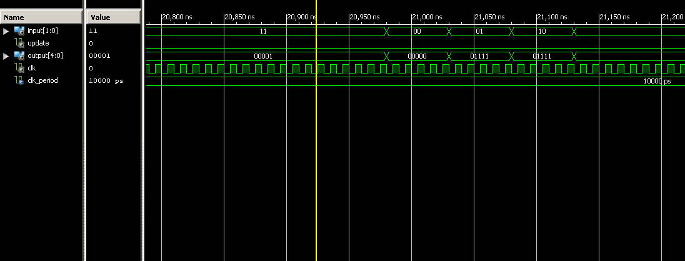

## Prelab
### Description
I would like to implement an artificial neural network in hardware, capable of learning to do basic operations (addition, subtraction, and, or) based solely on being given sample data for each. Since full learning is difficult (I believe that I can achieve it however), my interface will be simple, using the font controller and acting like a simple calculator. This project is fairly cutting edge, with the implementation of the math needed being the topic of multiple papers within the last couple years (Jamal, Khammas, “IMPLEMENTATION OF A SIGMOID ACTIVATION FUNCTION FOR NEURAL NETWORK USING FPGA”, and Rajeswaran,  “VHDL synthesizable hardware architecture design of back propagation neural networks”).

### Functionality Levels
Required – Network has full interface, but preset weights. This would simulate a static network with no learning. However, getting forward propagation to work properly involves some difficult math, especially in hardware. 
B – Network has the fully supporting modules needed for back propagation, notably the modules for creating test cases (needed many thousand for suitable learning).
A – Network is fully capable of back propagation learning (I anticipate the most difficulty here)

### Timeline
Realistically, this may take more time than I have available in class. However, I still believe that I can accomplish it.
A significant part of my project is understanding the AI construct itself, so I will need to spend multiple lessons on design.

By lesson Number
1-3: Understand back propagation algorithm. Understand the full design of each node, and how to train them
4: Create detailed designed of each part
5-6: Get Basic and B functionality (realistically, this project will need a significant deal of time outside of class. I plan on working the weekend of May 3-4 specifically on this project.
7: A functionality and presentation

### Hardware
No additional hardware beyond the Spartan 6 FPGA.

### Initial Design
Part of the major problem is creating a realistic design structure. 
I plan on having VHDL modules for both the sigmoid and back propagation functions, contained within a larger node module. However, the entirety of the actual processing will be done by the network. 

### Prepared to begin work
I am most of the way through understanding the algorithm. I need a little bit more on back propagation (I have acquired a suitable textbook), but should be good to go.

## Lab Write-up

### Introduction
This project implements a small artificial neural network in VHDL. While many software implementations of such networks can be found on the internet, none are publically available in any sort of hardware.
There are a small handful of papers that claim that the authors have implemented a network in VHDL, but no public source code.

### Introduction to Artificial Neural Networks
An artificial neural network is used for pattern recognition, where data is available and the pattern is not readily apparent. Its operation is similar to that of a biological brain.
The network consists of a number of interconnected nodes, with ones specifically to take input, and others that produce output. When a node "activates", it either excites or inhibits later nodes, causing a propagation throughout the network.
The magnitude of this excitement/inhibition is related to the strength of the previous node's activation, and the weight of each particular connection. The strength of the previous activation is multiplied by the weight of the connection.
Each of these inputs is summed, and fed into an activation function. The output of the activation function is then based on to future nodes.

### Training an Artificial Neural Network
In order for a neural network to function accurately, the weights for each connection need to be set properly. In this case, the network was trained using a technique known as back propagation.
For back propagation, a test input is presented to the network, and allowed to forward propagate. Then, the network is presented the expected output for that sample. The difference between the expected and actual output is used to update the weights used as input to the output nodes. The error correction then propagates backwards through the network.
The following equations were used in this network

#### Activation Function
A(x) = 1/(1+e^(-x))

#### Output Layer Weight Update
new weight = previous weight + learning rate * activation value from the previous node * (Expect Output - Actual Output) * A'(input to activation function of that node)

#### Hidden Layer Weight Update
new weight = previous weight + learning rate * activation value from the previous node * A'(input to activation function of that node) * Sum for each node in the next layer(weight of this node to output node * Error of output node * A'(input to output node's activation function))

### Design Approach
#### Understanding Problem
First, I needed to ensure that I fully understood the behavior of an artificial neural network. To accomplish this, I found a publically available neural net simulator, and created several test networks.
Additionally, I read the appropriate section in "Artificial Intelligence: A Modern Approach".

#### Sigmoid and Derivative of Sigmoid
Both of these relied on exponentiation, which would have created significant delay. Instead of implementing these mathematically, I used a lookup table, ensuring speed at the expense of space and ability to represent numbers in high accuracy.
I wrote a python script to create the VHDL code, as each table was 256 entries.

#### Feed Forward Network
The first part implemented in VHDL was a network that allowed for forward propagation, but was incapable of training. This ensured that the underlying structure was sound before I tried to implement learning.
The most difficult part of this was implementing fixed point twos complement math in hardware. After some consideration, I decided to use 8 bit numbers to represent weights and activation values.
Although additional precision would be preferable, it could not be accomplished due to the limits of the sigmoid and derivative of sigmoid modules.

#### Learning
##### New Weight Values
After a feed forward network had been successfully demonstrated, I needed to implement a module to produce updated weight values. Internally, I made a module to do 8 bit floating point math, and used it to create the updated values.
Additionally, new outputs had to be made to show the appropriate values with nodes farther back in the network.

##### Synchronized Weight Update
Since updated weight values are dependent on the values of the nodes that they are connected to, all weights had to be updated simultaneously to avoid concurrency issues.
This was done using a global update signal. The new weight values would be stored temporarily on the rising edge, and updated on the falling edge.

### Testing/Debugging
All testing was done using test benches in VHDL.
#### Individual modules
For modules such as the sigmoid and fixed point multiplication, I used VHDL test benches. The 8 bit multiplier required some tweaking after the initial test.
#### Feed forward
To test the functionality of the feed forward network, I created test values using the ANN simulation software previously mentioned, and looked to see if the network produced the expected response.
2 bit AND was tested. Initially, the network would not "pull down" outputs to zero. This was determined to be an issue with the use of nodes in the input layer (would produce an activation level of 0.5 for input of 0).
This was solved by replacing the input nodes with the direct input (0 or 1 instead of 0.5 or 1).
#### Learning
Learning functionality by testing all input combinations, 256 rounds of training (each round has all input combinations), and observing performance on a final test input set. Initially, no weights updated. This was due a combination of low values in the weight calculation multiplying to zero, due to low precision. Increasing these values provided a rough patch.
#### Learning Example XOR

  

Training Setup

  

Initial State of the Network. Note that the output is clearly incorrect.

  

Learning occuring. This is far more steps than actually needed to train this small a network.

  

End result. Notice that results are very close, but not 100%. This is due to a combination of the low precision of this implementation, and a general trait of neural networks. 

### YouTube video
https://www.youtube.com/watch?v=iCa7WTGlRZM

### Conclusion
Functionality Achieved: A
In conclusion, the design worked as planned, with the network being able to learn the AND, OR, and XOR functions. However, the network was limited in accuracy of the output, due to the small precision in number representation.
Due to the speed of the network, it seems a suitable tool for future study and improvement over similar networks in software.

I can be contacted at albntomat0@gmail.com for questions/comments.

### Further Work
This work will be continued next semester as an independent study. The goals of this study are to improve the precision of the current design, and implement a network used for a modern application of ANNs, such as handwriting recognition.

Update: Delayed to work BBC communication algorithm security.

### Documentation
Two's complement factions - https://stackoverflow.com/questions/9946183/2s-complement-representation-of-fractions
https://en.wikipedia.org/wiki/Fixed-point_arithmetic
http://pages.cs.wisc.edu/~cs354-1/beyond354/int.mult.html

Help with unusual xilinx error "The selected process was not run because a prior process failed" - solved by running clean project
http://cseweb.ucsd.edu/classes/wi11/cse141L/tipsandtricks.html

The text Artificial Intelligence: A Modern Approach and MIT OpenCourseware AI class (specifically the handout on neural nets) helped me understand the implementation
of neural networks.

Captain Silva provided support with trying to instantiate a number of modules based off of an input generic (not attempted in project). 
Dr. Martin Carlisle (DFCS) provided help with determining that the input level should not be nodes (mentioned in debugging section).

I viewed C2C Kevin Cooper's writeup to have a glimpse of excellence.
